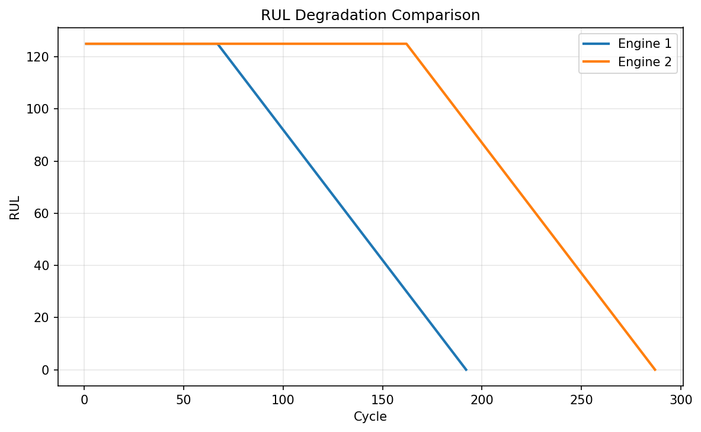
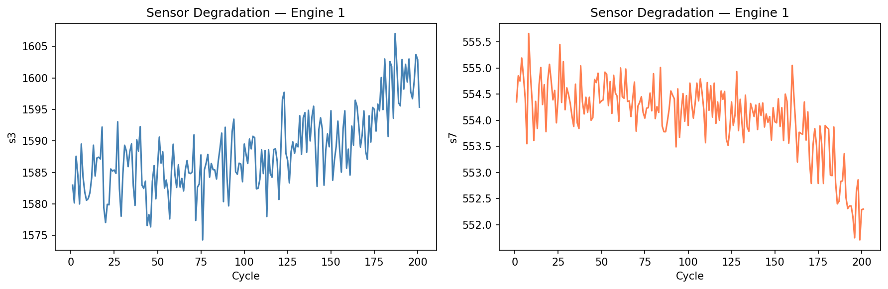
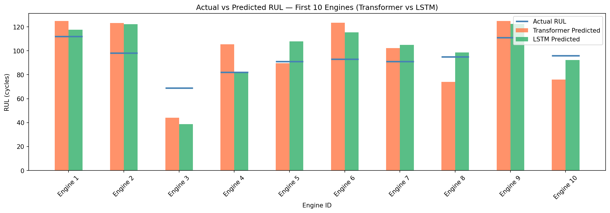
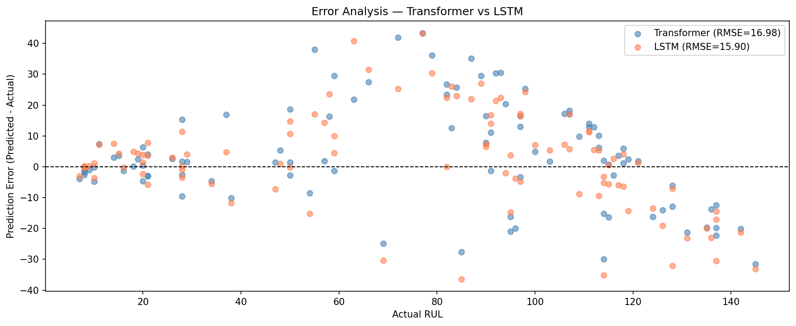
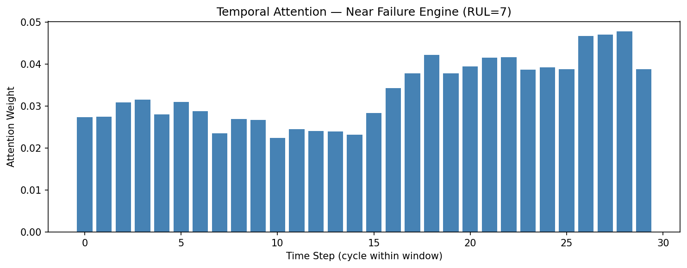
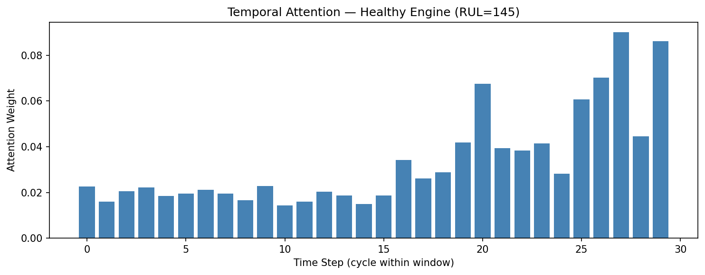
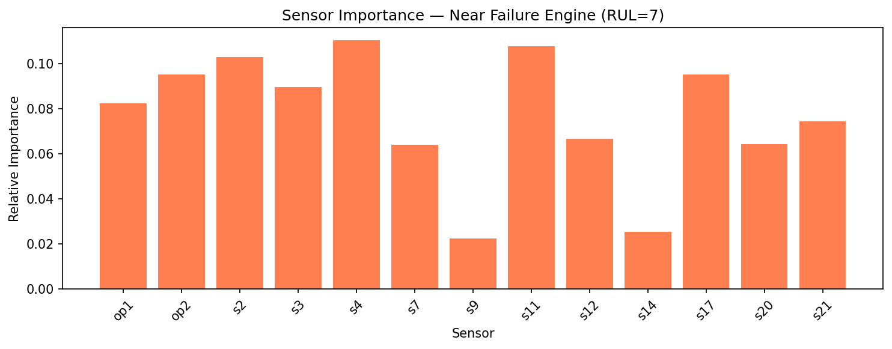
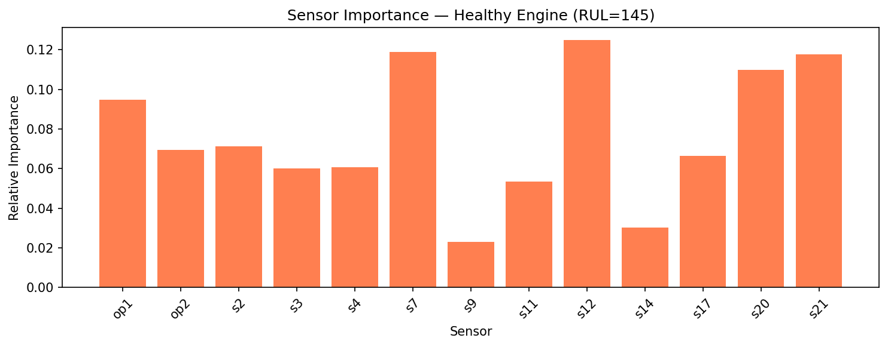

# Transformer vs LSTM for Turbofan Engine Remaining Useful Life Prediction

Comparing Transformer and LSTM sequence models on the NASA CMAPSS turbofan engine dataset for Remaining Useful Life (RUL) prediction — a real-world predictive maintenance problem in aerospace.

---

## Problem Statement

Turbofan engines degrade over time due to wear in critical components. Given multivariate sensor readings from an engine over its operational history, the goal is to predict how many cycles remain before failure — the **Remaining Useful Life (RUL)**.

Accurate RUL prediction enables proactive maintenance scheduling, reducing unplanned failures and operational costs in aviation and industrial systems.

---

## Dataset

**NASA CMAPSS (Commercial Modular Aero-Propulsion System Simulation) — FD001**

| Property | Value |
|---|---|
| Training engines | 100 |
| Test engines | 100 |
| Operating conditions | 1 (Sea Level) |
| Fault mode | HPC Degradation |
| Features | 26 columns (engine ID, cycle, 3 operational settings, 21 sensors) |

Each row represents one engine at one operational cycle. The training set runs engines to failure; the test set is cut off before failure. True RUL values for the test set are provided separately.

---

## Methodology

### Preprocessing
- Dropped 10 sensors with near-zero variance — constant across all cycles, carrying no degradation signal
- Applied **piecewise linear RUL clipping at 125 cycles** — standard practice in CMAPSS literature, reflecting that sensor drift becomes detectable only in the final ~125 cycles before failure
- MinMax normalized all features using training set statistics
- Created sliding windows of **30 cycles** per engine — each window labeled by the RUL at its last timestep

### RUL Distribution After Clipping



The spike at 125 represents healthy early-life cycles where degradation is not yet detectable. The flat region (0–124) represents the degradation phase where the model learns.

---

## Models

### Transformer Encoder
- Input projection → Positional Encoding → 3× TransformerEncoderLayer → Regression head
- Built entirely from scratch in PyTorch — no pretrained weights
- **152,961 parameters**

### LSTM Baseline
- 2-layer LSTM → Regression head
- **55,617 parameters**

Both models trained for 50 epochs with Adam optimizer and StepLR scheduler. MSE loss.

---

## Results

| Model | Test RMSE | Test MAE |
|---|---|---|
| Transformer | 16.98 | 12.77 |
| **LSTM** | **15.50** | **11.80** |

LSTM outperformed the Transformer on this dataset. This is consistent with literature suggesting transformers require larger datasets to outperform recurrent models — CMAPSS FD001 with 100 training engines is relatively small for transformer architectures. With more data or pretraining, transformers are expected to close this gap.

---

## Sensor Degradation

Monitoring key sensors over an engine's full lifecycle reveals clear degradation trends — rising temperatures and shifting pressure readings as the engine approaches failure.



---

## Predicted vs Actual RUL



Both models track actual RUL closely for most engines. Larger errors occur in the mid-RUL range (40–80 cycles) — the transition zone between healthy and degrading states.

---

## Error Analysis



**Key observations:**
- Both models are most accurate at **low RUL (0–20 cycles)** — the safety-critical zone where maintenance decisions matter most
- Errors increase in the mid-range (40–100 cycles) — expected, as the degradation signal is weaker during early onset
- Systematic underestimation at high RUL (>125) — a direct consequence of the 125-cycle clipping; the model is not designed to predict beyond this horizon

---

## Attention Analysis

Extracting attention weights from the Transformer reveals interpretable patterns in how the model processes sensor data.

### Temporal Attention — Which Cycles Matter?

| Near Failure (RUL = 7) | Healthy Engine (RUL = 145) |
|---|---|
|  |  |

- **Near failure:** attention is distributed evenly across all 30 cycles — every recent cycle shows severe degradation and contributes equally
- **Healthy engine:** attention concentrates on the most recent cycles — early cycles look identical to any healthy engine and carry no predictive signal

### Sensor Importance — Which Sensors Drive Predictions?

| Near Failure (RUL = 7) | Healthy Engine (RUL = 145) |
|---|---|
|  |  |

Sensor importance shifts between healthy and degrading states — the model implicitly learns which measurements are most informative at each stage of engine life, consistent with the underlying physics of HPC degradation.

---

## Limitations and Future Work

- **Dataset size:** FD001 has only 100 training engines — insufficient for transformers to show their full advantage over recurrent models
- **Single fault mode:** FD001 uses one fault mode (HPC degradation) and one operating condition. Results may differ on FD002/FD003/FD004 with multiple conditions and fault modes
- **Future:** Extend to all 4 CMAPSS sub-datasets; experiment with larger transformer models or pretraining on related datasets

---

## Setup

```bash
pip install torch numpy pandas scikit-learn matplotlib
```

Place `train_FD001.txt`, `test_FD001.txt`, and `RUL_FD001.txt` in the working directory, then run the notebook top to bottom.

---

## Hardware

Trained locally on **NVIDIA RTX 4050 Laptop GPU (6GB VRAM)** — no cloud compute used.

---

## References

- [A. Saxena et al., "Damage Propagation Modeling for Aircraft Engine Run-to-Failure Simulation", PHM08](https://ti.arc.nasa.gov/tech/dash/groups/pcoe/prognostic-data-repository/)
- [Attention Is All You Need — Vaswani et al. (2017)](https://arxiv.org/abs/1706.03762)
- [Transformer-based RUL prediction — Nature Scientific Reports (2024)](https://www.nature.com/articles/s41598-024-59095-3)
